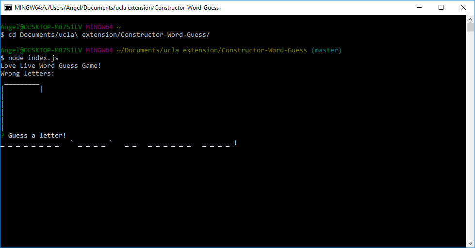
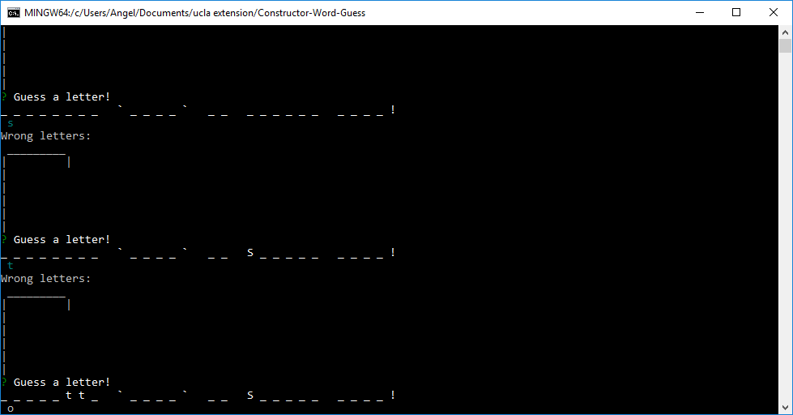
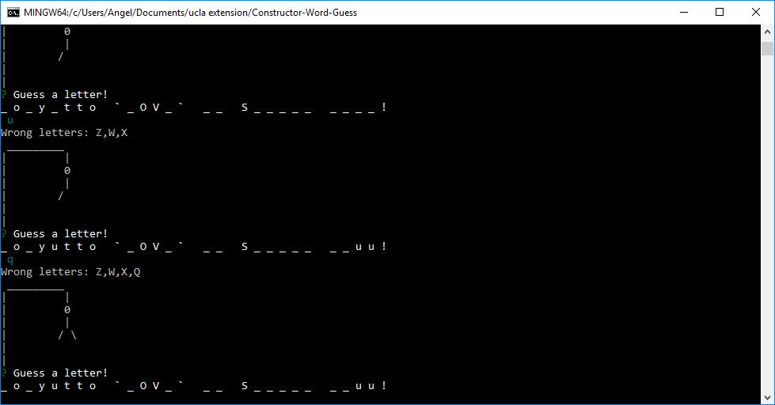
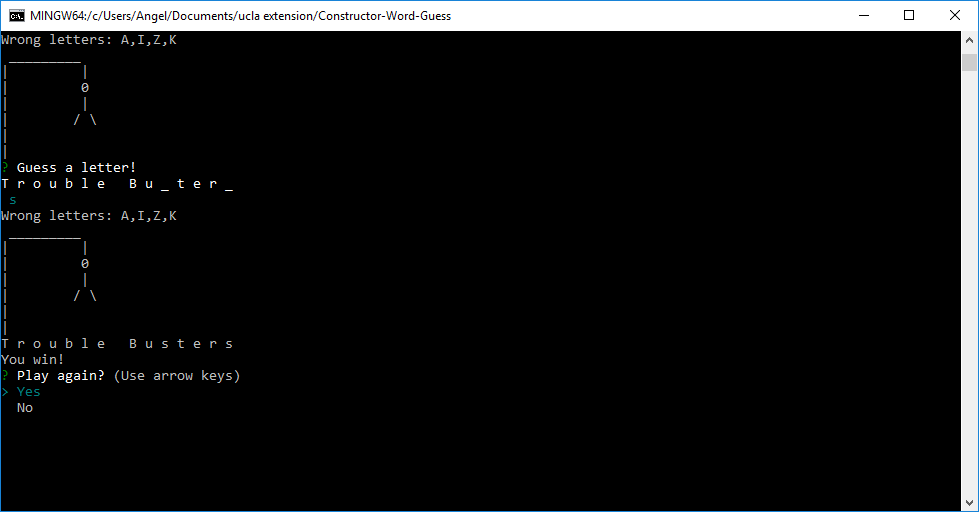
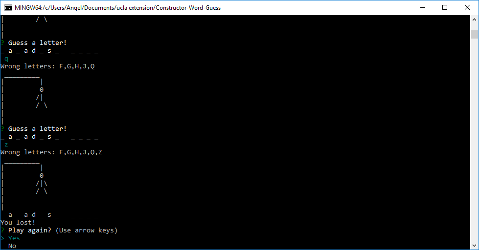
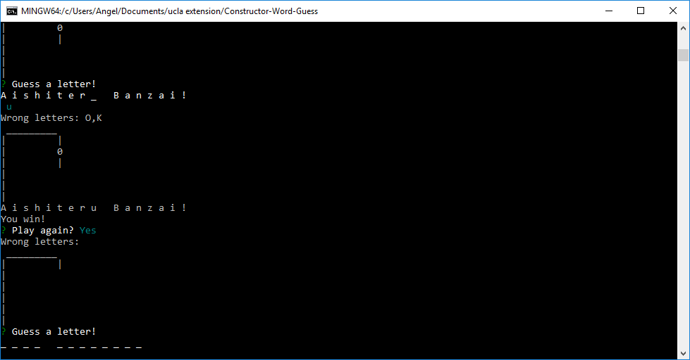
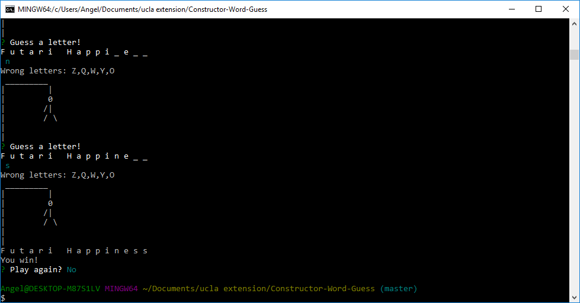

# Constructor-Word-Guess

## What it does
This app is a hangman game, similar to my other Word Guess Game (https://github.com/acuteangel/Word-Guess-Game). It uses the same word bank, consisting of Love Live songs. Players guess letters one at a time, trying to guess the song title before running out of guesses.

Upon start, the game will display the solution, with all letters replaced with "_". The player is prompted to enter a letter.

If the guessed letter matches letters in the title, the display is updated to have those letters filled in.

If the guessed letter does not match, it's added to the list of wrong letters and a body piece is added to the hangman.

If the title is solved a victory message is displayed and the player may play again or quit.

Similarly, if the player runs out of guesses then they'll receive a defeat message and receive the same prompt to play again.

If the player says yes, a new game will begin.

If the player says no, the game will end.

